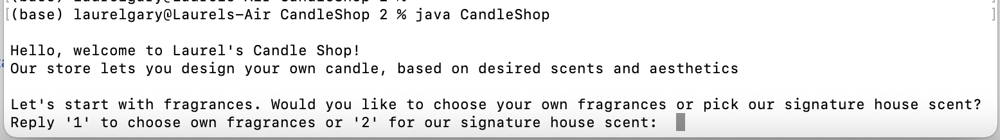
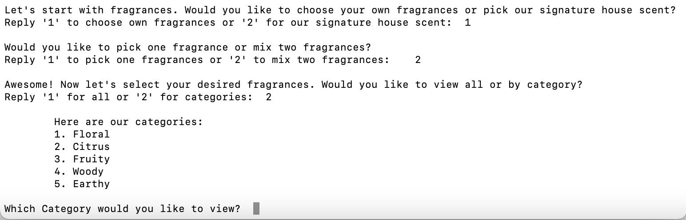
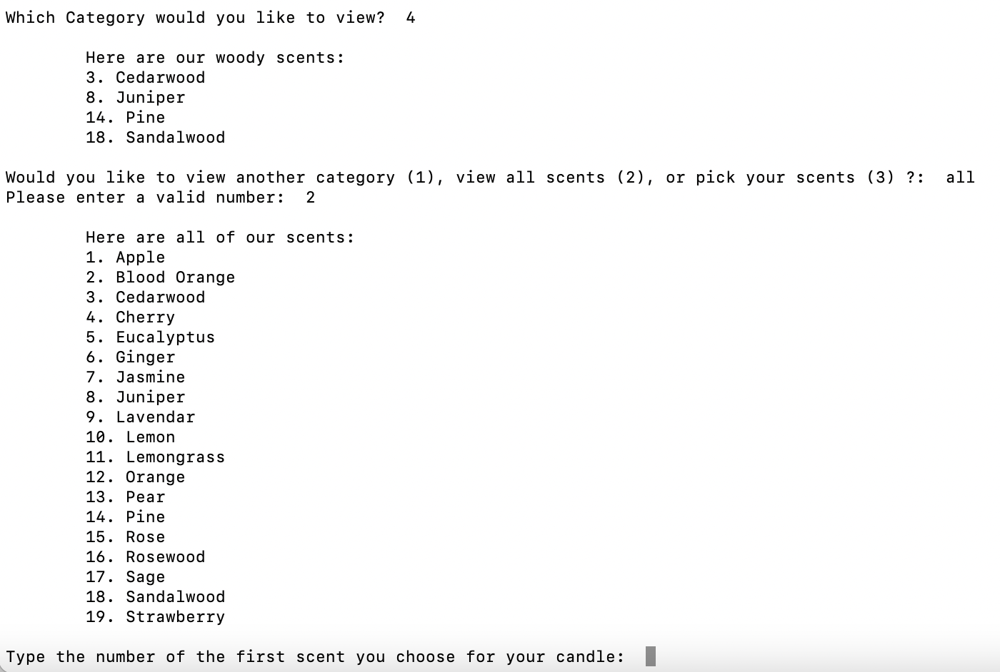
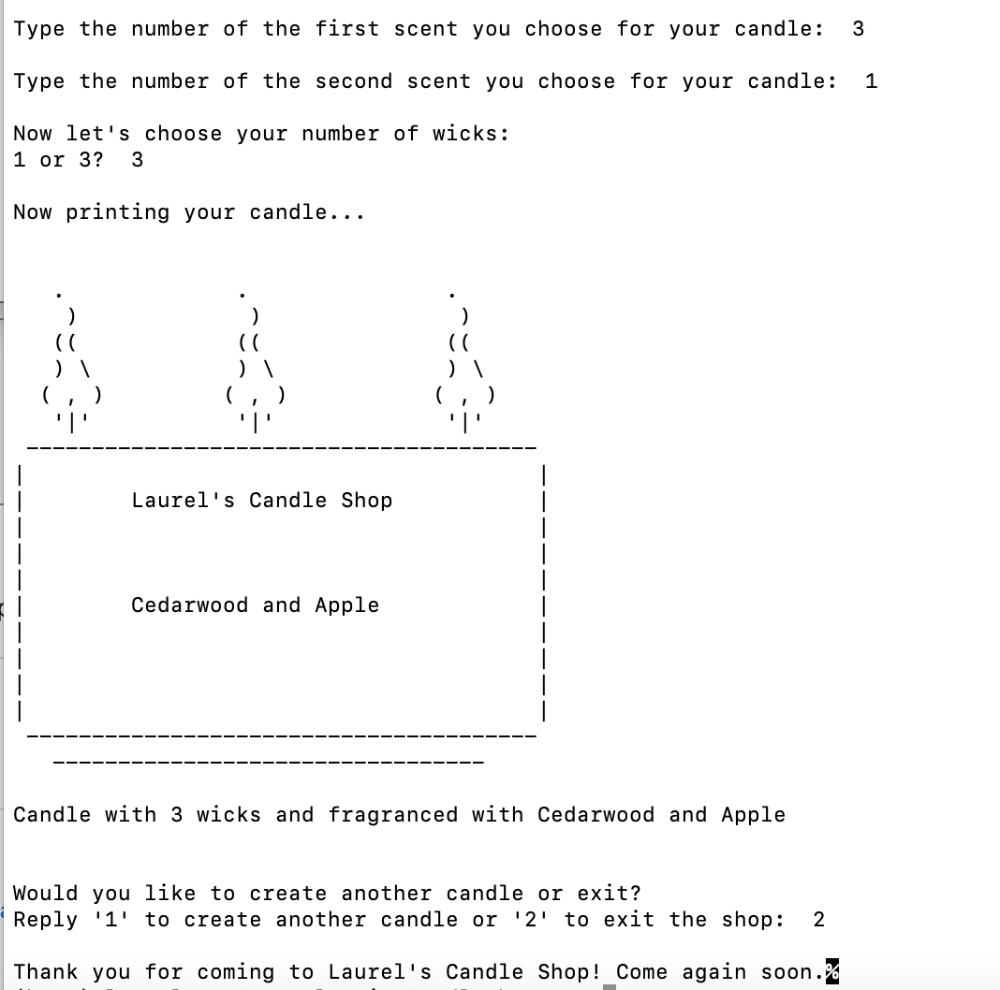

# CandleShop
I created an interactive candle shop created for my Objected Oriented Design final project. Laurel's Candle Shop utilizes user input to store preferences and in turn, print out an ascii version of their ideal candle.

To run the shop, clone the repository and run using the CandleShop.java class:

Choose your number of fragrances and view the options

After inputting your selected fragrances, your candle is printed out:

### Patterns Used
I utilized the **Flyweight** structural design pattern to efficiently manage varied user input for my Candle objects. The pattern used the abstract Candle class as base and _OneWickCandle_ and _ThreeWickCandle_ classes extend it. The Flyweight pattern worked well as the wrapper class, _FragrancedCandle_ allowed the Candle objects to maintain the core properties of one fragrance + wicks while adding another scent only if desired. I decided Flyweight over Builder or Decorator as they would involve the creation of two separate objects for adding a fragrance.

I chose the creational design pattern **Factory** to create my Candle object within the Flyweight pattern. This was extremely helpful as it outsourced the creation of the object and also decided which subclass I needed based on input, automatically creating a _OneWickCandle_ or _ThreeeWickCandle_ based on user input. 

My behavorial design pattern used is **State** to facilitate the changing states between fragrance categories. Multiple states were created for different fragrance categories (Floral, Woody, Citrus, etc.), as well as states for viewing All Fragrances and Categories. This pattern accommodated dynamic user decisions and allows users to explore all their options before making a final fragrance choice, eliminating the need to create a new FragranceJourney each time a change is required.
